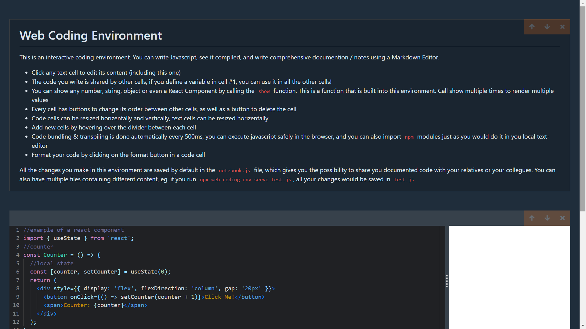

# Web Coding Env
The best web coding environment where you can safely write and execute javascript code, as well as documenting your code using markdown editors.
# Preview

# Getting Started
This Project uses a CLI to start a local express API, which serves the react app. To get started, install the package from npm or yarn as shown below:

`npm install web-coding-env@latest`
 
or
`yarn add web-coding-env@latest`
